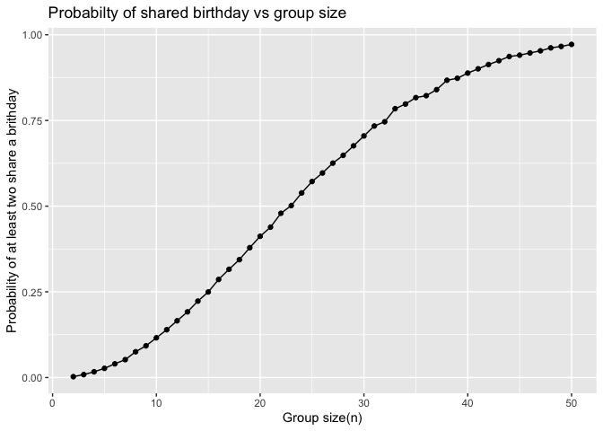
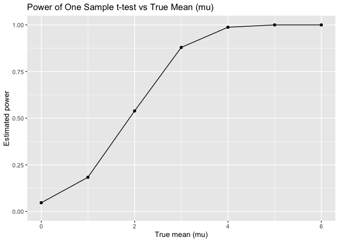
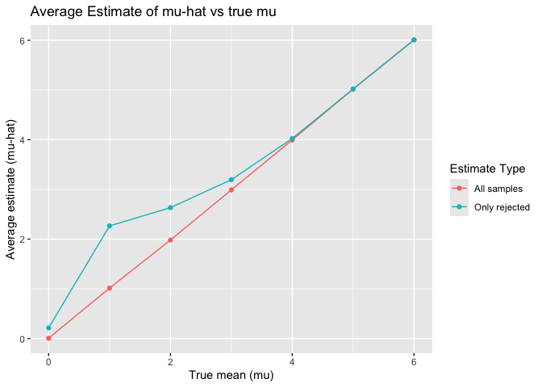

p8105_hw5_jt3649
================
Juan Tang
2025-11-12

### Problem 1

``` r
set.seed(1)
birthday_sim = function(n_people){
  birthdays = sample(1:365, size = n_people, replace = TRUE) #draw n_people birthdays, each between 1 and 365
  any(duplicated(birthdays)) # return true if any birthday appears more than once
}
```

``` r
n_sims = 10000 # number of simulations
birthday_results = 
  tibble(n = 2:50) |>
  mutate(
    # for each n, do 10000 independent simulations
    sim_results = map(
      n, 
      ~ replicate(n_sims, birthday_sim(.x))
    )
  ) |>
  # turn the logical vectors into long format
  unnest_longer(sim_results, values_to = "shared_birthday") |>
  group_by(n) |>
  summarize(
    prob_shared = mean(shared_birthday), # "TRUE" = 1, "FALSE" = 0"
    .groups = "drop"
  )
head(birthday_results)
```

    ## # A tibble: 6 × 2
    ##       n prob_shared
    ##   <int>       <dbl>
    ## 1     2      0.0024
    ## 2     3      0.0085
    ## 3     4      0.0167
    ## 4     5      0.0267
    ## 5     6      0.0399
    ## 6     7      0.0521

``` r
birthday_results |>
  ggplot(aes(x = n, y = prob_shared)) + 
  geom_line() + 
  geom_point() + 
  labs(
    x = "Group size(n)", 
    y = "Probability of at least two share a brithday", 
    title = "Probabilty of shared birthday vs group size"
  )
```

<!-- -->

#### Comment

- When the group sizes are small, the probability of two shared the same
  birthday is close to 0.

- The probability increases as n increases, and is above 0.5 when n is
  approx. 23.

- For relatively larger groups (close to 50), the probability of shared
  birthday approaches 1, indicating it is extremely likely that at least
  two people share a birthday.

### Problem 2

#### Simulation result

``` r
set.seed(12345)
# function that runs simulations for a given true mean "mu_true"

n = 30
sigma = 5
mu_true = 0
mu_values = 0:6
n_sims = 5000

sim_results = expand_grid(
  mu = mu_values, 
  sim = 1:5000
) |>
  mutate(
    # for each row (mu, sim) generate data from N(mu, sigma)
    x = map(mu, ~rnorm(n = n, mean = .x, sd = sigma)), 
    # one sample t-test of H0: mu = 0
    t_out = map(x, ~t.test(.x, mu = 0)), 
    # tidy the output
    t_tidy = map(t_out, broom::tidy)
  ) |>
  unnest(t_tidy) |>
  select(mu, sim, estimate, p.value)
```

#### Power result

``` r
power_results = 
  sim_results |>
  group_by(mu) |> # group all 5000 simulations by the true mu
  summarise(
    power = mean(p.value < 0.05), # compute the proportion of p-values that are < 0.05
    .groups = "drop" 
  )

power_results |>
  knitr::kable(
    caption = "Power Estimates for Each True Mean (mu)", 
    digits = 3, 
    align = "c"
  )
```

| mu  | power |
|:---:|:-----:|
|  0  | 0.047 |
|  1  | 0.183 |
|  2  | 0.539 |
|  3  | 0.879 |
|  4  | 0.988 |
|  5  | 1.000 |
|  6  | 1.000 |

Power Estimates for Each True Mean (mu)

``` r
ggplot(power_results, aes(x = mu, y = power)) +
  geom_line() + # connect points with line
  geom_point() +
  labs(
    x = "True mean (mu)",
    y = "Estimated power",
    title = "Power of One Sample t-test vs True Mean (mu)"
  ) +
  ylim(0, 1) # range, power is between 0 and 1
```

<!-- -->

#### mu-hat Result

``` r
mu_hat_results =
  sim_results |>
  group_by(mu) |> # group by true mean
  summarize(
    avg_estimate_all = mean(estimate), # calculate the avg sample mean across all simulations
    avg_estimate_reject = mean(estimate[p.value < 0.05]), # calculate the avg sample mean only when H0 rejected (ie. p<0.05)
    .groups = "drop"
  )

mu_hat_long = # convert to long format
  mu_hat_results |>
  pivot_longer(
    cols = c(avg_estimate_all, avg_estimate_reject),
    names_to = "estimate_type",
    values_to = "mean_estimate"
  ) |>
  mutate(
    estimate_type = case_when(
      estimate_type == "avg_estimate_all" ~ "All samples", 
      estimate_type == "avg_estimate_reject" ~ "Only rejected"
    )
  )
```

#### Average estimate of mu-hat vs true mu plot

``` r
ggplot(
  mu_hat_long, 
       aes(x = mu, 
           y = mean_estimate, 
           color = estimate_type)
  ) +
  geom_line() +
  geom_point() +
  labs(
    x = "True mean (mu)",
    y = "Average estimate (mu-hat)",
    color = "Estimate Type",
    title = "Average Estimate of mu-hat vs true mu"
  )
```

<!-- -->

``` r
knitr::kable(mu_hat_results)
```

|  mu | avg_estimate_all | avg_estimate_reject |
|----:|-----------------:|--------------------:|
|   0 |        0.0059007 |           0.2138705 |
|   1 |        1.0141136 |           2.2655000 |
|   2 |        1.9809631 |           2.6325599 |
|   3 |        2.9903366 |           3.1953078 |
|   4 |        3.9952562 |           4.0242561 |
|   5 |        5.0191115 |           5.0191115 |
|   6 |        6.0092273 |           6.0092273 |

Is the sample average of 𝜇̂ across tests for which the null is rejected
approximately equal to the true value of 𝜇? Why or why not?

- No. The sample avg of 𝜇̂ among simulations where H0 is rejected does
  not approx. equal to the true value of mu due to selection bias.
- When power is low (true mu is small), only samples with unusually
  large mu-hat lead to rejection of H0. So, the conditional mean is
  biased upward.
- As mu increases and power approaches 1, nearly all samples reject, so
  the bias decreases and the conditional mean appraoches the true mu.

### Problem 3

``` r
homicides_raw = 
  read_csv("homicide-data.csv")
```

    ## Rows: 52179 Columns: 12
    ## ── Column specification ────────────────────────────────────────────────────────
    ## Delimiter: ","
    ## chr (9): uid, victim_last, victim_first, victim_race, victim_age, victim_sex...
    ## dbl (3): reported_date, lat, lon
    ## 
    ## ℹ Use `spec()` to retrieve the full column specification for this data.
    ## ℹ Specify the column types or set `show_col_types = FALSE` to quiet this message.

#### Description of dataset

The raw dataset contains one row per homicide case. There are 52179
observations, and 12 variables.

Important variables include: - `uid`: case ID - `reported_date`: date
the homicide was reported - `city`, `state`: location of the homicide -
`victim_last`,`victim_first`, `victim_race`, `victim_age`, `victim_sex`:
demographic information of the victim - `disposition`: case status

#### Homicides by city_state

``` r
homicides_city = 
  homicides_raw |>
  # create city_state variable
  mutate(
    city_state = str_c(city, ",", state), 
    # indicator for unsolved cases ("closed without arrest" or "open/no arrest")
    unsolved = if_else(
      disposition %in% c("Closed without arrest", "Open/No arrest"), 
      1, # unsolved
      0, # solved
    )
  ) |>
  group_by(city_state) |>
  summarize(
    n_homicides = n(), # total number of homicides in city
    n_unsolved = sum(unsolved), # number of unsolved homicides
  )

knitr::kable(homicides_city)
```

| city_state        | n_homicides | n_unsolved |
|:------------------|------------:|-----------:|
| Albuquerque,NM    |         378 |        146 |
| Atlanta,GA        |         973 |        373 |
| Baltimore,MD      |        2827 |       1825 |
| Baton Rouge,LA    |         424 |        196 |
| Birmingham,AL     |         800 |        347 |
| Boston,MA         |         614 |        310 |
| Buffalo,NY        |         521 |        319 |
| Charlotte,NC      |         687 |        206 |
| Chicago,IL        |        5535 |       4073 |
| Cincinnati,OH     |         694 |        309 |
| Columbus,OH       |        1084 |        575 |
| Dallas,TX         |        1567 |        754 |
| Denver,CO         |         312 |        169 |
| Detroit,MI        |        2519 |       1482 |
| Durham,NC         |         276 |        101 |
| Fort Worth,TX     |         549 |        255 |
| Fresno,CA         |         487 |        169 |
| Houston,TX        |        2942 |       1493 |
| Indianapolis,IN   |        1322 |        594 |
| Jacksonville,FL   |        1168 |        597 |
| Kansas City,MO    |        1190 |        486 |
| Las Vegas,NV      |        1381 |        572 |
| Long Beach,CA     |         378 |        156 |
| Los Angeles,CA    |        2257 |       1106 |
| Louisville,KY     |         576 |        261 |
| Memphis,TN        |        1514 |        483 |
| Miami,FL          |         744 |        450 |
| Milwaukee,wI      |        1115 |        403 |
| Minneapolis,MN    |         366 |        187 |
| Nashville,TN      |         767 |        278 |
| New Orleans,LA    |        1434 |        930 |
| New York,NY       |         627 |        243 |
| Oakland,CA        |         947 |        508 |
| Oklahoma City,OK  |         672 |        326 |
| Omaha,NE          |         409 |        169 |
| Philadelphia,PA   |        3037 |       1360 |
| Phoenix,AZ        |         914 |        504 |
| Pittsburgh,PA     |         631 |        337 |
| Richmond,VA       |         429 |        113 |
| Sacramento,CA     |         376 |        139 |
| San Antonio,TX    |         833 |        357 |
| San Bernardino,CA |         275 |        170 |
| San Diego,CA      |         461 |        175 |
| San Francisco,CA  |         663 |        336 |
| Savannah,GA       |         246 |        115 |
| St. Louis,MO      |        1677 |        905 |
| Stockton,CA       |         444 |        266 |
| Tampa,FL          |         208 |         95 |
| Tulsa,AL          |           1 |          0 |
| Tulsa,OK          |         583 |        193 |
| Washington,DC     |        1345 |        589 |

#### Unsolved homicides in Baltimore, MD

``` r
baltimore = homicides_city |>
  filter(city_state == "Baltimore,MD")
baltimore
```

    ## # A tibble: 1 × 3
    ##   city_state   n_homicides n_unsolved
    ##   <chr>              <int>      <dbl>
    ## 1 Baltimore,MD        2827       1825

``` r
# run prop.test for Baltimore
baltimore_prop = 
  prop.test(
    x = baltimore$n_unsolved, # number of unsolved cases
    n = baltimore$n_homicides # total number of cases
  )

# tidy the output
baltimore_tidy = 
  baltimore_prop |>
  broom::tidy()

# extract estimated prop. and CI
baltimore_estimate = 
  baltimore_tidy |>
  select(estimate, conf.low, conf.high)

knitr::kable(baltimore_estimate)
```

|  estimate |  conf.low | conf.high |
|----------:|----------:|----------:|
| 0.6455607 | 0.6275625 | 0.6631599 |

The estimated proportion of homicides that are unsolved in Baltimore,MD
is 0.6455607.

The 95% confidence interval is (0.6275625, 0.6631599)

#### Proportion of unsolved homicides in all cities

``` r
city_prop_results = 
  homicides_city |>
  mutate(
    # list col of prop.test objects
    prop_test = map2(
      n_unsolved, 
      n_homicides, 
      ~ prop.test(x = .x, n = .y)
    ), 
    # list col of tidy data frames
    prop_tidy = map(prop_test, broom::tidy)
  ) |>
  unnest(prop_tidy) |>
  select(
    city_state, 
    n_homicides, 
    n_unsolved, 
    estimate, 
    conf.low, 
    conf.high
  )
```

    ## Warning: There was 1 warning in `mutate()`.
    ## ℹ In argument: `prop_test = map2(n_unsolved, n_homicides, ~prop.test(x = .x, n
    ##   = .y))`.
    ## Caused by warning in `prop.test()`:
    ## ! Chi-squared approximation may be incorrect

``` r
knitr::kable(city_prop_results)
```

| city_state        | n_homicides | n_unsolved |  estimate |  conf.low | conf.high |
|:------------------|------------:|-----------:|----------:|----------:|----------:|
| Albuquerque,NM    |         378 |        146 | 0.3862434 | 0.3372604 | 0.4375766 |
| Atlanta,GA        |         973 |        373 | 0.3833505 | 0.3528119 | 0.4148219 |
| Baltimore,MD      |        2827 |       1825 | 0.6455607 | 0.6275625 | 0.6631599 |
| Baton Rouge,LA    |         424 |        196 | 0.4622642 | 0.4141987 | 0.5110240 |
| Birmingham,AL     |         800 |        347 | 0.4337500 | 0.3991889 | 0.4689557 |
| Boston,MA         |         614 |        310 | 0.5048860 | 0.4646219 | 0.5450881 |
| Buffalo,NY        |         521 |        319 | 0.6122841 | 0.5687990 | 0.6540879 |
| Charlotte,NC      |         687 |        206 | 0.2998544 | 0.2660820 | 0.3358999 |
| Chicago,IL        |        5535 |       4073 | 0.7358627 | 0.7239959 | 0.7473998 |
| Cincinnati,OH     |         694 |        309 | 0.4452450 | 0.4079606 | 0.4831439 |
| Columbus,OH       |        1084 |        575 | 0.5304428 | 0.5002167 | 0.5604506 |
| Dallas,TX         |        1567 |        754 | 0.4811742 | 0.4561942 | 0.5062475 |
| Denver,CO         |         312 |        169 | 0.5416667 | 0.4846098 | 0.5976807 |
| Detroit,MI        |        2519 |       1482 | 0.5883287 | 0.5687903 | 0.6075953 |
| Durham,NC         |         276 |        101 | 0.3659420 | 0.3095874 | 0.4260936 |
| Fort Worth,TX     |         549 |        255 | 0.4644809 | 0.4222542 | 0.5072119 |
| Fresno,CA         |         487 |        169 | 0.3470226 | 0.3051013 | 0.3913963 |
| Houston,TX        |        2942 |       1493 | 0.5074779 | 0.4892447 | 0.5256914 |
| Indianapolis,IN   |        1322 |        594 | 0.4493192 | 0.4223156 | 0.4766207 |
| Jacksonville,FL   |        1168 |        597 | 0.5111301 | 0.4820460 | 0.5401402 |
| Kansas City,MO    |        1190 |        486 | 0.4084034 | 0.3803996 | 0.4370054 |
| Las Vegas,NV      |        1381 |        572 | 0.4141926 | 0.3881284 | 0.4407395 |
| Long Beach,CA     |         378 |        156 | 0.4126984 | 0.3629026 | 0.4642973 |
| Los Angeles,CA    |        2257 |       1106 | 0.4900310 | 0.4692208 | 0.5108754 |
| Louisville,KY     |         576 |        261 | 0.4531250 | 0.4120609 | 0.4948235 |
| Memphis,TN        |        1514 |        483 | 0.3190225 | 0.2957047 | 0.3432691 |
| Miami,FL          |         744 |        450 | 0.6048387 | 0.5685783 | 0.6400015 |
| Milwaukee,wI      |        1115 |        403 | 0.3614350 | 0.3333172 | 0.3905194 |
| Minneapolis,MN    |         366 |        187 | 0.5109290 | 0.4585150 | 0.5631099 |
| Nashville,TN      |         767 |        278 | 0.3624511 | 0.3285592 | 0.3977401 |
| New Orleans,LA    |        1434 |        930 | 0.6485356 | 0.6231048 | 0.6731615 |
| New York,NY       |         627 |        243 | 0.3875598 | 0.3494421 | 0.4270755 |
| Oakland,CA        |         947 |        508 | 0.5364308 | 0.5040588 | 0.5685037 |
| Oklahoma City,OK  |         672 |        326 | 0.4851190 | 0.4467861 | 0.5236245 |
| Omaha,NE          |         409 |        169 | 0.4132029 | 0.3653146 | 0.4627477 |
| Philadelphia,PA   |        3037 |       1360 | 0.4478103 | 0.4300380 | 0.4657157 |
| Phoenix,AZ        |         914 |        504 | 0.5514223 | 0.5184825 | 0.5839244 |
| Pittsburgh,PA     |         631 |        337 | 0.5340729 | 0.4942706 | 0.5734545 |
| Richmond,VA       |         429 |        113 | 0.2634033 | 0.2228571 | 0.3082658 |
| Sacramento,CA     |         376 |        139 | 0.3696809 | 0.3211559 | 0.4209131 |
| San Antonio,TX    |         833 |        357 | 0.4285714 | 0.3947772 | 0.4630331 |
| San Bernardino,CA |         275 |        170 | 0.6181818 | 0.5576628 | 0.6753422 |
| San Diego,CA      |         461 |        175 | 0.3796095 | 0.3354259 | 0.4258315 |
| San Francisco,CA  |         663 |        336 | 0.5067873 | 0.4680516 | 0.5454433 |
| Savannah,GA       |         246 |        115 | 0.4674797 | 0.4041252 | 0.5318665 |
| St. Louis,MO      |        1677 |        905 | 0.5396541 | 0.5154369 | 0.5636879 |
| Stockton,CA       |         444 |        266 | 0.5990991 | 0.5517145 | 0.6447418 |
| Tampa,FL          |         208 |         95 | 0.4567308 | 0.3881009 | 0.5269851 |
| Tulsa,AL          |           1 |          0 | 0.0000000 | 0.0000000 | 0.9453792 |
| Tulsa,OK          |         583 |        193 | 0.3310463 | 0.2932349 | 0.3711192 |
| Washington,DC     |        1345 |        589 | 0.4379182 | 0.4112495 | 0.4649455 |

#### Proportion of unsolved homicides plot

``` r
city_prop_results |>
  # organize cities according to the proportion of unsolved homicides
  mutate(
    city_state = fct_reorder(city_state, estimate)
  ) |>
  ggplot(
    aes(x = estimate, 
        y = city_state)
    ) + 
      geom_point() + 
      # add errorbar based on 95% CI
      geom_errorbar(
        aes(xmin = conf.low, 
            xmax = conf.high), 
        width = 0
    )+ 
      labs(
        title = "Estimated Proportion of Unsolved Homicides by City", 
        x = "Estimated proportion unsolved (95% CI)", 
        y = "City"
      ) 
```

<!-- -->
